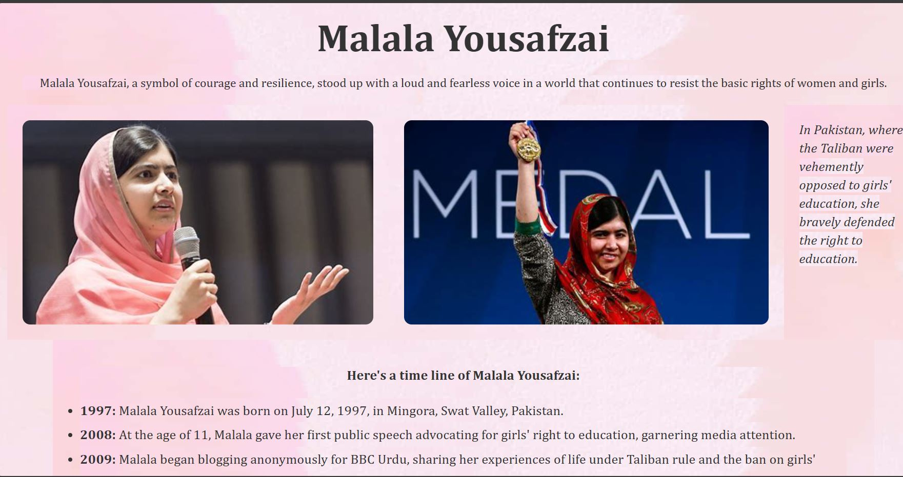

# tribute-page 🚀

## Project Description 📝

> This project is a tribute page about Malala Yousufzai dedicated to Malala Yousufzai, the youngest Nobel Prize laureate and a promninet advocate for girls, education.The page highlights her life, achievements, and the impact she has made on the world.

## Demo 📸



## Technologies Used 🛠️

- HTML
- CSS

## Installation 💻

To viwe and modify this project, follow these steps.

1. **Clone the repository:**

```bash
git clone git@github.com:faridafaqiri/Technical-documentation-page.git

```

## Usage 🎯

after clone the repository in your local machine you can open the html file in your browser.
to access the code of project you can open it visual studio code editor.

## Author 👩‍💻

You can contact me through the following:

- LinkedIn: (<https://www.linkedin.com/in/farida-faqiri-071a31309/>)
- Email: (<farida.faqiri2@gmail.com>)

## Contributing 🤝

If you would like to contribute to this project, feel free to submit a pull request. For major changes, please open an issue first to discuss what you would like to change.
